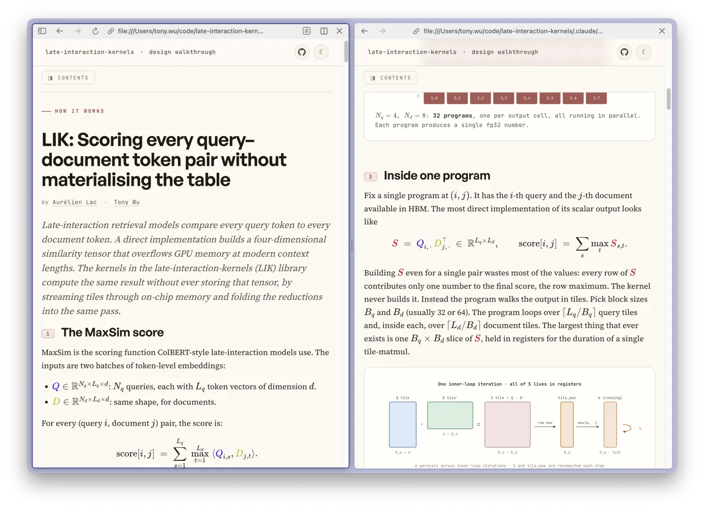

<div align="center">

# late-interaction-kernels


[](https://arxiv.org/abs/2004.12832)
[](https://github.com/lightonai/pylate)
[](https://github.com/illuin-tech/colpali)
[](https://huggingface.co/Hcompany)

[](https://github.com/hcompai/late-interaction-kernels/actions/workflows/ci.yml)
[](https://pypi.org/project/late-interaction-kernels/)
[](https://pepy.tech/project/late-interaction-kernels)

---

[[How it works]](https://hcompai.github.io/late-interaction-kernels/how-it-works.html)
[[Benchmarks]](docs/benchmarks.md)
[[Design]](docs/design.md)
[[Changelog]](CHANGELOG.md)

</div>

<table>
<tr>
<td width="55%" valign="middle">

The full algorithmic walkthrough (tiling, online max, the backward pass) with step-through animations and benchmark plots lives on the docs site:

**👉 [hcompai.github.io/late-interaction-kernels](https://hcompai.github.io/late-interaction-kernels/how-it-works.html)**

</td>
<td width="45%" valign="middle" align="center">

<a href="https://hcompai.github.io/late-interaction-kernels/how-it-works.html">
  
</a>

</td>
</tr>
</table>

## Introduction

`late-interaction-kernels` provides fused Triton and Metal kernels for **MaxSim**, the late-interaction scoring at the heart of ColBERT, ColPali, ModernColBERT, LateOn and ColBERTv2. They're numerically identical to plain PyTorch, but fuse the similarity matrix, max-reduction and (optional) L2-normalisation into a single launch, so the full `[Nq, Nd, Lq, Ld]` score tensor never lands in HBM. That buys two wins at once: **lower peak VRAM**, because the tensor (quadratic in the contrastive batch size) is never allocated, and **higher throughput**, because the naive path is bandwidth-bound — it writes that tensor to HBM and reads it straight back — so skipping it removes the dominant memory traffic.

[PyLate](https://github.com/lightonai/pylate) and [colpali-engine](https://github.com/illuin-tech/colpali) support them natively: install the extra and their `auto` dispatch picks the kernels up, no code change. You can also call them directly: a stateless `MaxSimScorer` module for custom training loops, or function-level entry points (`maxsim`, `maxsim_varlen`, `maxsim_padded`, ...) for everything else.

## Install

```bash
pip install late-interaction-kernels
```

| Platform                       | Backend                                                                       |
| ------------------------------ | ----------------------------------------------------------------------------- |
| Linux + CUDA (sm_75+)          | Fused Triton kernels (autotuned, FP8 on Hopper/Blackwell).                    |
| macOS (Apple Silicon, MPS)     | Fused Metal `simdgroup_matrix` kernels for inference and training (fp16 / bf16, `d ≤ 128`); `torch.compile` fallback otherwise. |
| CPU / Windows                  | Autograd-aware pure-PyTorch reference.                                        |

## Quickstart

### Score directly (`maxsim` / `maxsim_pairs`)

`maxsim` is the lowest-level public entry point: autograd-aware, mask-aware, and dispatches on `D.dim()`, so one call covers in-batch and knowledge-distillation layouts in a single fused launch. The argmax buffer for the backward is skipped automatically when neither input requires grad, so this is the inference path too.

```python
from late_interaction_kernels import maxsim, maxsim_pairs

# in-batch:  Q[Nq, Lq, d] × D[Nd, Ld, d]    → [Nq, Nd]
scores = maxsim(Q, D, q_mask=q_mask, d_mask=d_mask, normalize=True)

# KD / hard-negative:  D is 4D [Nq, K, Ld, d]  → [Nq, K]   (one launch, no Python loop)
scores = maxsim(Q, D_kd, q_mask=q_mask, d_mask=d_mask_kd)

# pairwise (diagonal):  Q[B, Lq, d] × D[B, Ld, d]  → [B]
scores = maxsim_pairs(Q, D, q_mask=q_mask, d_mask=d_mask)
```

### PyLate & colpali-engine

Both ship a native LIK backend: install the extra and their `auto` dispatch picks it up, no code change (force it with `PYLATE_SCORES_BACKEND=lik` / `COLPALI_SCORES_BACKEND=lik`). On older versions the `patch_*` drop-ins route scoring + loss through the fused kernel at import time (`LIK_DISABLE=1` falls back; deprecated no-ops once native support is present).

<table>
<tr>
<td width="50%" valign="top">

**PyLate ≥ 1.5.1**

```bash
pip install "pylate[lik]"
```

PyLate < 1.5.1:

```python
import late_interaction_kernels as lik
lik.patch_pylate()
```

</td>
<td width="50%" valign="top">

**colpali-engine ≥ 0.3.17**

```bash
pip install "colpali-engine[lik]"
```

colpali-engine < 0.3.17:

```python
import late_interaction_kernels as lik
lik.patch_colpali_engine()
```

</td>
</tr>
</table>

### Top-k retrieval

Score `Q` against a large corpus and return the top-`k` per query without materialising the full `[Nq, Nd]` matrix. `chunk=` streams documents in tiles so peak HBM stays bounded.

```python
from late_interaction_kernels import retrieve

scores, indices = retrieve(Q, D, top_k=100, chunk=4096)
# both [Nq, 100]; chunk= bounds peak HBM at Nq * (chunk + top_k)
```

<details>
<summary><strong>PLAID</strong>: compressed, ragged ColBERTv2 indexes</summary>

<br>

For PLAID-style indexes where documents are stored as centroid codes + residuals at variable lengths. A single kernel fuses decompression, L2-normalisation and MaxSim. No decoded tensor is ever written back to HBM.

```python
from late_interaction_kernels.plaid import maxsim_residual_varlen

scores = maxsim_residual_varlen(
    Q, codes_flat, residuals_flat, cu_seqlens_d,
    centroids=centroids, bucket_weights=bucket_weights,
    nbits=2, normalize=True,
)  # [Nd] fp32; one kernel does decompress + L2-normalize + MaxSim
```

</details>

<details>
<summary><strong>Custom training loop</strong>: stateless <code>MaxSimScorer</code> module</summary>

<br>

A stateless `nn.Module` wrapper around `maxsim`. Drop it into any training loop that needs autograd-aware late-interaction scoring without touching PyLate.

```python
from late_interaction_kernels import MaxSimScorer

scorer = MaxSimScorer(normalize=True)                # nn.Module, no parameters
scores = scorer(Q, D, q_mask=q_mask, d_mask=d_mask)  # [Nq, Nd] fp32
scores.mean().backward()
```

</details>

## Benchmarks

1×H100 80GB SXM, bf16 inputs / fp32 accumulator, 50-iter median. All
speedups are measured at **matched numerics**: every baseline runs the
einsum with an fp32 accumulator (same as the fused kernel), and parity
is asserted at `atol=1e-2` before timing.

### Speed

|             | Rerank /<br>inference | PyLate<br>cached-contrastive | PLAID rerank<br>vs `fast_plaid` | Fused D-head<br>(training) | FP8 vs bf16<br>(Hopper) | LateOn-Code-edge<br>e2e |
| ----------- | --------------------- | ---------------------------- | ------------------------------- | -------------------------- | ----------------------- | ----------------------- |
| **Speedup** | 1.7-16×               | 5.0-6.9×                     | 8-23× full<br>18-51× partial    | 0.94-4.5×                  | 1.1-1.3×                | 1.00-1.06×              |

Rerank is vs both the eager fp32-accumulator path *and* `torch.compile`;
PLAID rerank includes top-k; the fused D-head win grows with `Nd · Ld`
(the two smallest LateOn shapes are 0.94-0.95×, i.e. slightly slower;
≥1.4× from `Nd=128, Ld=1024` up — every ColBERT/ColPali-scale shape);
FP8 is at `Ld ≥ 256`. Full tables and reproduction commands live in
[`docs/benchmarks.md`](docs/benchmarks.md); for how the bench scripts
themselves are organised — CLI conventions (`--only`, `--variants`),
per-script summaries, and how to run one bench, the whole sweep, or a
`RUN_ONLY`-filtered subset on a SkyPilot cluster — see
[`benchmarks/README.md`](benchmarks/README.md).

### Memory

The naive einsum materialises the full `[Nq · Nd · Lq · Ld]` similarity
tensor in fp32 before `max(-1)`; its column reports the measured allocator
peak, which runs above the similarity tensor alone because the fp32-cast
operand copies coexist with it. The fused kernel never writes any of that:
document tiles stream through SRAM and only `[Nq, Nd]` scores come back,
plus a `[Nq · Nd, Lq]` int32 argmax buffer when training.

| shape                                     | naive scratch | fused fwd | fused fwd + bwd |
| ----------------------------------------- | ------------- | --------- | --------------- |
| `Nq=1, Nd=1k, Lq=32, Ld=300`              | 183 MB        | 4 KB      | 128 KB          |
| `Nq=1, Nd=1k, Lq=128, Ld=1024` (ColPali)  | 1.0 GB        | 4 KB      | 512 KB          |
| `Nq=16, Nd=32, Lq=32, Ld=8192`            | 2.1 GB        | 2 KB      | 64 KB           |

The ColPali row assumes a short text query expanded to `Lq = 128`
(ColBERT-style query augmentation) against a `Ld ≈ 1024`-patch page.

This runs long-context shapes (`Ld ≥ 8k`) that OOM the naive path, and fits
~5–10× more in-batch negatives at a fixed HBM budget. In real ColQwen2
training (80 GB H100, LoRA + grad-ckpt, `vidore/colpali_train_set`) vanilla
colpali-engine OOMs at `batch=128` where the MaxSim op holds 7.8 GiB; the
fused kernel holds 61 MiB and doubles the batch ceiling at the same step time.
The backward keeps the discipline: `auto` routes gradient-heavy shapes to
`lowmem`, writing `grad_Q` / `grad_D` in the input dtype (no full-size fp32
buffer, no atomics, deterministic) for roughly half the backward peak, e.g. a
`B256 × 16-neg` ColPali step from 4.3 GB to 2.2 GB. Full tables in
[`docs/benchmarks.md`](docs/benchmarks.md#memory).

## API

| Symbol                                                | What it does                                                          |
| ----------------------------------------------------- | --------------------------------------------------------------------- |
| `patch_pylate()` / `unpatch_pylate()`                 | One-line PyLate drop-in. `LIK_DISABLE=1` kill switch.                 |
| `patch_colpali_engine()` / `unpatch_colpali_engine()` | One-line colpali_engine drop-in (loss + scoring route through the kernel). |
| `MaxSimScorer(normalize=, backward=)`                 | Stateless `nn.Module`, autograd-aware.                                |
| `retrieve(Q, D, top_k, chunk=)`                       | Top-k retrieval, chunked for huge corpora.                            |
| `maxsim`                                              | Core MaxSim. Dispatches on `D.dim()`: 3D → in-batch `[Nq, Nd]`, 4D → per-query KD candidates `[Nq, K]` (one fused launch, no Python loop). Autograd-aware. |
| `maxsim_pairs`                                        | Diagonal pairs `Q[B, Lq, d] × D[B, Ld, d] → [B]`. K=1 case of the KD path; never builds the `[B, B]` cross product. Autograd-aware. |
| `maxsim_varlen`                                       | Packed (`cu_seqlens`) layout. Autograd-aware.                         |
| `maxsim_padded`                                       | Padded reranking wrapper: packs internally, returns `[B, C]` fp32.    |

Other kernels are in submodules: `padded`, `score_pairs`, `fused_head`, `plaid`, `fp8`, `reference`. See [`docs/design.md`](docs/design.md) for details on every kernel, the autograd graph and the backward variants.

<details>
<summary><strong>🔽 Configuration knobs (env vars + kwargs)</strong></summary>

| Knob                                                              | Effect                                                            |
| ----------------------------------------------------------------- | ----------------------------------------------------------------- |
| `maxsim(..., backward="auto" \| "unified" \| "lowmem")`    | Per-call backward strategy. `"auto"` picks per shape: `"lowmem"` (bf16 grads, ~½ peak memory, deterministic) where gradient buffers dominate, `"unified"` (fastest) elsewhere. |
| `LIK_DISABLE=1`                                                   | Patched entry points delegate to vanilla PyLate / colpali_engine. |
| `LIK_SUPPRESS_NORM_WARN=1`                                        | Silence the "looks unnormalized" one-shot warning.                |
| `LIK_DISABLE_COMPILE=1`                                           | Skip `torch.compile` on the MPS path (eager fallback).            |
| `LIK_FORCE_MPS_BACKEND={metal,compile,reference}`                 | Pin the MPS dispatch.                                             |

</details>

## Development

```bash
git clone https://github.com/hcompai/late-interaction-kernels
cd late-interaction-kernels
uv sync --extra dev --extra pylate --extra torch-cuda   # GPU dev; use --extra torch-cpu on CPU-only boxes
uv run pytest -q                                        # CUDA tests auto-skip without a GPU
uv run ruff check . && uv run ruff format --check .
```

> [!NOTE]
> Pick exactly one of `--extra torch-cuda` (pulls torch from the CUDA index — `cu124`) or `--extra torch-cpu` (CPU-only wheel, what CI uses). The two are declared as conflicting in `pyproject.toml` so the lockfile resolves cleanly for both. On macOS, `--extra torch-cpu` falls back to PyPI's default (MPS-capable) wheel automatically.

See [`CONTRIBUTING.md`](CONTRIBUTING.md) for the contribution workflow, including how GPU tests run.

## Related projects

<details>
<summary><strong>⚡ MaxSim implementations</strong></summary>

<br>

- [roipony/flash-maxsim](https://github.com/roipony/flash-maxsim) — fused Triton kernel that tiles the similarity matrix in SRAM instead of materialising it in HBM.
- [erikkaum/maxsim](https://github.com/erikkaum/maxsim) — exact MaxSim with hand-written CUDA (NVIDIA) and Metal (Apple Silicon) kernels; avoids materialising the similarity matrix on either backend.
- [mixedbread-ai/maxsim-cpu](https://github.com/mixedbread-ai/maxsim-cpu) — Rust + SIMD CPU implementation (libxsmm on x86, Accelerate on ARM) for environments without a GPU.

</details>

<details>
<summary><strong>🏋️ Late interaction training libraries</strong></summary>

<br>

- [lightonai/pylate](https://github.com/lightonai/pylate) — ColBERT-style training and retrieval on top of Sentence Transformers; native LIK backend since [pylate#222](https://github.com/lightonai/pylate/pull/222).
- [illuin-tech/colpali](https://github.com/illuin-tech/colpali) — training and inference for ColPali / ColQwen2 visual late-interaction retrievers; native LIK backend since [colpali#412](https://github.com/illuin-tech/colpali/pull/412).
- [stanford-futuredata/ColBERT](https://github.com/stanford-futuredata/ColBERT) — the original late-interaction retriever, with ColBERTv2 training and PLAID indexing.

</details>

<details>
<summary><strong>🔍 Late interaction retrieval engines</strong></summary>

<br>

- [lightonai/fast-plaid](https://github.com/lightonai/fast-plaid) — fast PLAID index + search engine for ColBERT-style multi-vector retrieval.
- [lightonai/next-plaid](https://github.com/lightonai/next-plaid) — LightOn's next-generation PLAID engine (home of the Rust ColGrep runtime).

</details>

## Citation

```bibtex
@software{late_interaction_kernels_2026,
  author  = {Lac, Aurélien and Wu, Tony},
  title   = {{late-interaction-kernels}: Fused Triton kernels for late-interaction scoring},
  year    = {2026},
  url     = {https://github.com/hcompai/late-interaction-kernels},
}
```
