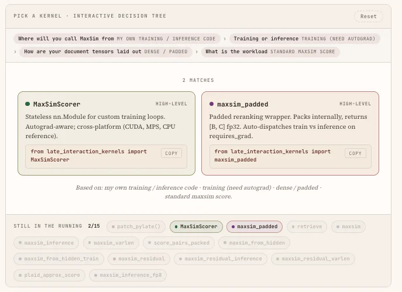

<div align="center">

# late-interaction-kernels


[](https://arxiv.org/abs/2004.12832)
[](https://github.com/lightonai/pylate)
[](https://github.com/illuin-tech/colpali)
[](https://huggingface.co/Hcompany)

[](https://github.com/hcompai/late-interaction-kernels/actions/workflows/ci.yml)
[](https://pypi.org/project/late-interaction-kernels/)
[](https://pepy.tech/project/late-interaction-kernels)

---

[[How it works]](https://hcompai.github.io/late-interaction-kernels/how-it-works.html)
[[Kernel picker]](https://hcompai.github.io/late-interaction-kernels/choose-a-kernel.html)
[[Benchmarks]](docs/benchmarks.md)
[[Design]](docs/design.md)
[[Supported models]](docs/supported_models.md)
[[Changelog]](CHANGELOG.md)

</div>

> [!NOTE]
> Full algorithmic walkthrough, animations and benchmark plots live on the docs site: **[hcompai.github.io/late-interaction-kernels](https://hcompai.github.io/late-interaction-kernels/how-it-works.html)**.

## Introduction

`late-interaction-kernels` provides fused Triton kernels for **MaxSim**, the late-interaction scoring used by ColBERT, ColPali, ModernColBERT, LateOn and ColBERTv2. The kernels are numerically identical to plain PyTorch and come with three APIs:

- a one-line PyLate drop-in (`patch_pylate()`),
- a stateless `nn.Module` (`MaxSimScorer`) for custom training loops,
- function-level entry points (`maxsim`, `maxsim_varlen`, `maxsim_padded`, ...) for everything else.

This is **not** a search engine. For end-to-end training or retrieval use [PyLate](https://github.com/lightonai/pylate), [FastPlaid](https://github.com/lightonai/fast-plaid) or [NextPlaid](https://github.com/lightonai/next-plaid). This library is the MaxSim math they compile down to.

## Install

```bash
pip install late-interaction-kernels
```

| Platform                       | Backend                                                                       |
| ------------------------------ | ----------------------------------------------------------------------------- |
| Linux + CUDA (sm_75+)          | Fused Triton kernels (autotuned, FP8 on Hopper).                              |
| macOS (Apple Silicon, MPS)     | Fused Metal `simdgroup_matrix` kernels for inference and training (fp16 / bf16, `d ≤ 128`); `torch.compile` fallback otherwise. |
| CPU / Windows                  | Autograd-aware pure-PyTorch reference.                                        |

## Quickstart

### Score directly (`maxsim` / `maxsim_pairs`)

`maxsim` is the lowest-level public entry point — autograd-aware, mask-aware, and dispatches on `D.dim()` so the same call covers in-batch and knowledge-distillation layouts in one fused launch. The argmax buffer for the backward is skipped automatically when neither input has `requires_grad=True`, so the same function is the inference path too.

```python
from late_interaction_kernels import maxsim, maxsim_pairs

# in-batch:  Q[Nq, Lq, d] × D[Nd, Ld, d]    → [Nq, Nd]
scores = maxsim(Q, D, q_mask=q_mask, d_mask=d_mask, normalize=True)

# KD / hard-negative:  D is 4D [Nq, K, Ld, d]  → [Nq, K]
# Single launch, no Python loop, no [Nq, Nq] cross product.
scores = maxsim(Q, D_kd, q_mask=q_mask, d_mask=d_mask_kd)

# pairwise (diagonal):  Q[B, Lq, d] × D[B, Ld, d]  → [B]
scores = maxsim_pairs(Q, D, q_mask=q_mask, d_mask=d_mask)
```

### Top-k retrieval

Score `Q` against a large corpus and return the top-`k` per query without materialising the full `[Nq, Nd]` matrix — `chunk=` streams documents in tiles so peak HBM stays bounded.

```python
from late_interaction_kernels import retrieve

scores, indices = retrieve(Q, D, top_k=100, chunk=4096)
# both [Nq, 100]; chunk= bounds peak HBM at Nq * (chunk + top_k)
```

### PLAID / ColBERTv2 on compressed, ragged docs

For PLAID-style indexes where documents are stored as centroid codes + residuals at variable lengths. A single kernel fuses decompression, L2-normalisation and MaxSim — no decoded tensor is ever written back to HBM.

```python
from late_interaction_kernels.plaid import maxsim_residual_varlen

scores = maxsim_residual_varlen(
    Q, codes_flat, residuals_flat, cu_seqlens_d,
    centroids=centroids, bucket_weights=bucket_weights,
    nbits=2, normalize=True,
)  # [Nd] fp32; one kernel does decompress + L2-normalize + MaxSim
```

### Custom training loop

A stateless `nn.Module` wrapper around `maxsim` — drop it into any training loop that needs autograd-aware late-interaction scoring without touching PyLate.

```python
from late_interaction_kernels import MaxSimScorer

scorer = MaxSimScorer(normalize=True)                # nn.Module, no parameters
scores = scorer(Q, D, q_mask=q_mask, d_mask=d_mask)  # [Nq, Nd] fp32
scores.mean().backward()
```

### Patch PyLate (one line)

Monkey-patches PyLate's scoring + loss to route through the fused kernel. Existing PyLate training and rerank scripts run unchanged; set `LIK_DISABLE=1` to fall back to vanilla PyLate at runtime.

```python
from late_interaction_kernels import patch_pylate

patch_pylate()
# PyLate training / rerank code is unchanged
```

## Benchmarks

1×H100 80GB SXM, bf16 inputs / fp32 accumulator, 50-iter median. All
speedups are measured at **matched numerics** — every baseline runs the
einsum with an fp32 accumulator (same as the fused kernel), and parity
is asserted at `atol=1e-2` before timing.

| Workload                                                    | Speedup            |
| ----------------------------------------------------------- | ------------------ |
| Reranking / inference (vs eager fp32-acc *and* `torch.compile`) | 1.7-16×        |
| Long-context (`Ld ≥ 8k`) MaxSim fwd+bwd                     | runs; naive OOMs   |
| PyLate cached-contrastive MaxSim + backward (vs vanilla)    | 5.0-6.9×           |
| PLAID rerank vs `fast_plaid.engine.search()` (incl. top-k)  | 8-23× full / 18-51× partial |
| Fused D-side head (training)                                | 1.5-4.5× on `Nd · Ld` large |
| FP8 MaxSim inference vs same kernel in bf16 (Hopper)        | 1.1-1.3× on `Ld ≥ 256` |
| LateOn-Code-edge training (real MS MARCO triplets)          | 1.00-1.06× e2e     |

Full tables and reproduction commands
live in [`docs/benchmarks.md`](docs/benchmarks.md); for how the bench
scripts themselves are organised — CLI conventions (`--only`,
`--variants`), per-script summaries, and how to run one bench, the
whole sweep, or a `RUN_ONLY`-filtered subset on a SkyPilot cluster —
see [`benchmarks/README.md`](benchmarks/README.md).

## Memory

The speedups are only half the story. The naive einsum allocates the full
`[Nq · Nd · Lq · Ld]` similarity tensor as fp32 scratch before the
`max(-1)` reduction. The fused kernel never writes it: document tiles
stream through SRAM and only the `[Nq, Nd]` scores come back, plus a
`[Nq · Nd, Lq]` int32 argmax buffer when training.

| shape                                     | naive scratch | fused fwd | fused fwd + bwd |
| ----------------------------------------- | ------------- | --------- | --------------- |
| `Nq=1, Nd=1k, Lq=32, Ld=300`              | 183 MB        | 4 KB      | 128 KB          |
| `Nq=1, Nd=1k, Lq=1024, Ld=1024` (ColPali) | 4.5 GB        | 4 KB      | 4 MB            |
| `Nq=16, Nd=32, Lq=32, Ld=8192`            | 2.1 GB        | 64 KB     | 64 KB           |

Two things this buys you: long-context shapes (`Ld ≥ 8k`) that OOM the
naive path at sane batch sizes run fine here, and at a fixed HBM budget
you fit roughly 5–10× more in-batch negatives than vanilla PyLate. Full
table in [`docs/benchmarks.md`](docs/benchmarks.md#memory).

The backward keeps the same discipline. `auto` routes the gradient-heavy
shapes — knowledge-distillation / hard-negative layouts and large in-batch
squares — to the `lowmem` path, which writes `grad_Q` / `grad_D` straight in
the input dtype (fp32 accumulation in registers, no full-size fp32 buffer, no
atomics). That roughly halves backward peak memory and is deterministic, e.g.
a `B256 × 16-neg` ColPali step drops from 4.3 GB to 2.2 GB.

## Choose a kernel

<table>
<tr>
<td width="55%" valign="middle">

Not sure which entry point fits your stack? The docs site ships an interactive decision tree that narrows the public API down to the right function in four questions (stack · phase · layout · workload):

**👉 [hcompai.github.io/late-interaction-kernels/choose-a-kernel.html](https://hcompai.github.io/late-interaction-kernels/choose-a-kernel.html#choose-a-kernel)**

</td>
<td width="45%" valign="middle" align="center">

<a href="https://hcompai.github.io/late-interaction-kernels/choose-a-kernel.html#choose-a-kernel">
  
</a>

</td>
</tr>
</table>

## API

| Symbol                                                | What it does                                                          |
| ----------------------------------------------------- | --------------------------------------------------------------------- |
| `patch_pylate()` / `unpatch_pylate()`                 | One-line PyLate drop-in. `LIK_DISABLE=1` kill switch.                 |
| `patch_colpali_engine()` / `unpatch_colpali_engine()` | One-line colpali_engine drop-in (loss + scoring route through the kernel). |
| `MaxSimScorer(normalize=, backward=)`                 | Stateless `nn.Module`, autograd-aware.                                |
| `retrieve(Q, D, top_k, chunk=)`                       | Top-k retrieval, chunked for huge corpora.                            |
| `maxsim`                                              | Core MaxSim. Dispatches on `D.dim()`: 3D → in-batch `[Nq, Nd]`, 4D → per-query KD candidates `[Nq, K]` (one fused launch, no Python loop). Autograd-aware. |
| `maxsim_pairs`                                        | Diagonal pairs `Q[B, Lq, d] × D[B, Ld, d] → [B]`. K=1 case of the KD path; never builds the `[B, B]` cross product. Autograd-aware. |
| `maxsim_varlen`                                       | Packed (`cu_seqlens`) layout. Autograd-aware.                         |
| `maxsim_padded`                                       | Padded reranking wrapper: packs internally, returns `[B, C]` fp32.    |

Other kernels are in submodules: `padded`, `score_pairs`, `fused_head`, `plaid`, `fp8`, `reference`. See [`docs/design.md`](docs/design.md) for details on every kernel, the autograd graph and the backward variants.

<details>
<summary><strong>🔽 Configuration knobs (env vars + kwargs)</strong></summary>

| Knob                                                              | Effect                                                            |
| ----------------------------------------------------------------- | ----------------------------------------------------------------- |
| `maxsim(..., backward="auto" \| "unified" \| "lowmem" \| ...)`    | Per-call backward strategy. `"auto"` picks per shape: `"lowmem"` (bf16 grads, ~½ peak memory, deterministic) where gradient buffers dominate, `"unified"` (fastest) elsewhere. |
| `LIK_DISABLE=1`                                                   | Patched entry points delegate to vanilla PyLate / colpali_engine. |
| `LIK_SUPPRESS_NORM_WARN=1`                                        | Silence the "looks unnormalized" one-shot warning.                |
| `LIK_DISABLE_COMPILE=1`                                           | Skip `torch.compile` on the MPS path (eager fallback).            |
| `LIK_FORCE_MPS_BACKEND={metal,compile,reference}`                 | Pin the MPS dispatch.                                             |

</details>

## Development

```bash
git clone https://github.com/hcompai/late-interaction-kernels
cd late-interaction-kernels
uv sync --extra dev --extra pylate --extra torch-cuda   # GPU dev; use --extra torch-cpu on CPU-only boxes
uv run pytest -q                                        # CUDA tests auto-skip without a GPU
uv run ruff check . && uv run ruff format --check .
```

> [!NOTE]
> Pick exactly one of `--extra torch-cuda` (pulls torch from the CUDA index — `cu124`) or `--extra torch-cpu` (CPU-only wheel, what CI uses). The two are declared as conflicting in `pyproject.toml` so the lockfile resolves cleanly for both. On macOS, `--extra torch-cpu` falls back to PyPI's default (MPS-capable) wheel automatically.

GPU tests run on AWS CodeBuild (A10G). They do not fire on pushes to `main` (CodeBuild spend); they run automatically on `v*` tag pushes and on PRs carrying the `run-gpu-tests` label (applying the label requires triage+, so ping a maintainer if your PR needs it). Maintainers can also trigger an on-demand run via the [GPU CI workflow](https://github.com/hcompai/late-interaction-kernels/actions/workflows/gpu-ci.yml) `workflow_dispatch`.

See [`CONTRIBUTING.md`](CONTRIBUTING.md) for the contribution workflow.

## Related projects

- [roipony/flash-maxsim](https://github.com/roipony/flash-maxsim) — fused Triton kernel that tiles the similarity matrix in SRAM instead of materialising it in HBM.
- [erikkaum/maxsim](https://github.com/erikkaum/maxsim) — exact MaxSim with hand-written CUDA (NVIDIA) and Metal (Apple Silicon) kernels; avoids materialising the similarity matrix on either backend.
- [mixedbread-ai/maxsim-cpu](https://github.com/mixedbread-ai/maxsim-cpu) — Rust + SIMD CPU implementation (libxsmm on x86, Accelerate on ARM) for environments without a GPU.

## Citation

```bibtex
@software{late_interaction_kernels_2026,
  author  = {Lac, Aurélien and Wu, Tony},
  title   = {{late-interaction-kernels}: Fused Triton kernels for late-interaction scoring},
  year    = {2026},
  url     = {https://github.com/hcompai/late-interaction-kernels},
}
```
